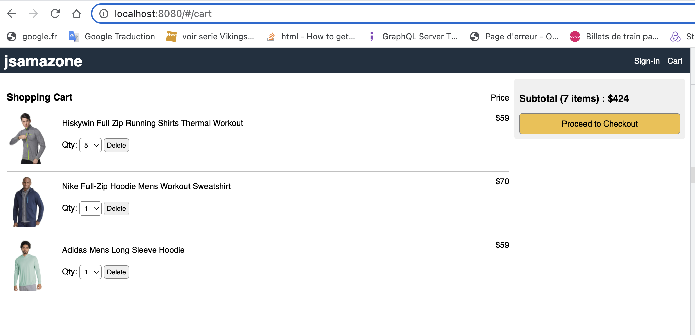
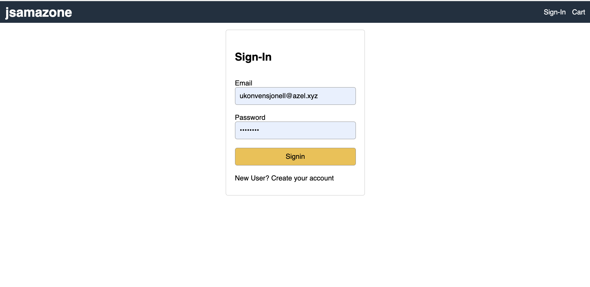
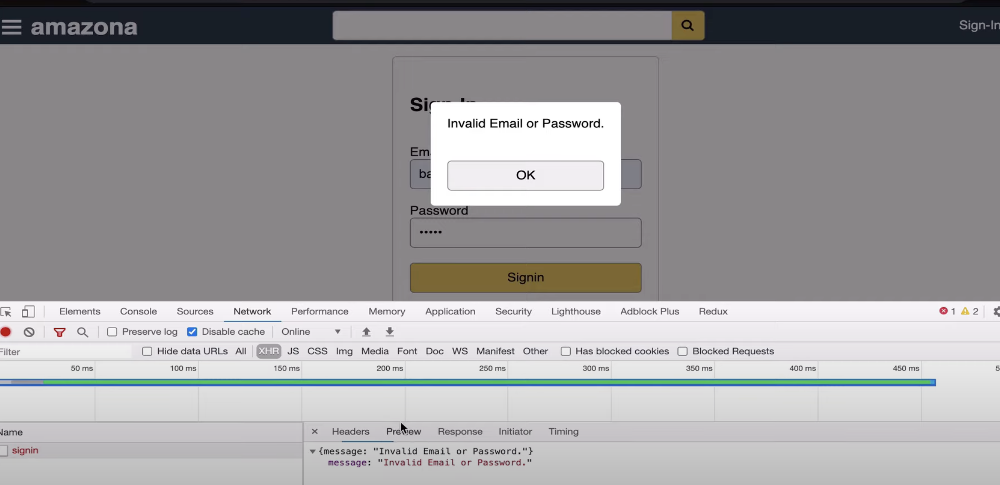

### FULL JAVASCRIPT WEB-SITE : AMAZONE
Welcome to my React and Node tutorial to build a fully-functional e-commerce website exactly like
### `In This Tutorial You Will Learn`

HTML5 and CSS3: Semantic Elements, CSS Grid, Flexbox
JavaScript: ES6+, Array Functions, Rendering System
Node & Express: Web API, Body Parser, File Upload, JWT
MongoDB: Mongoose, Aggregation
Development: ESLint, Babel, Git, Github,
Deployment: Heroku
Watch React & Node Tutorial

### `Screen shot`
 
 
 
 
 
 
 
 
